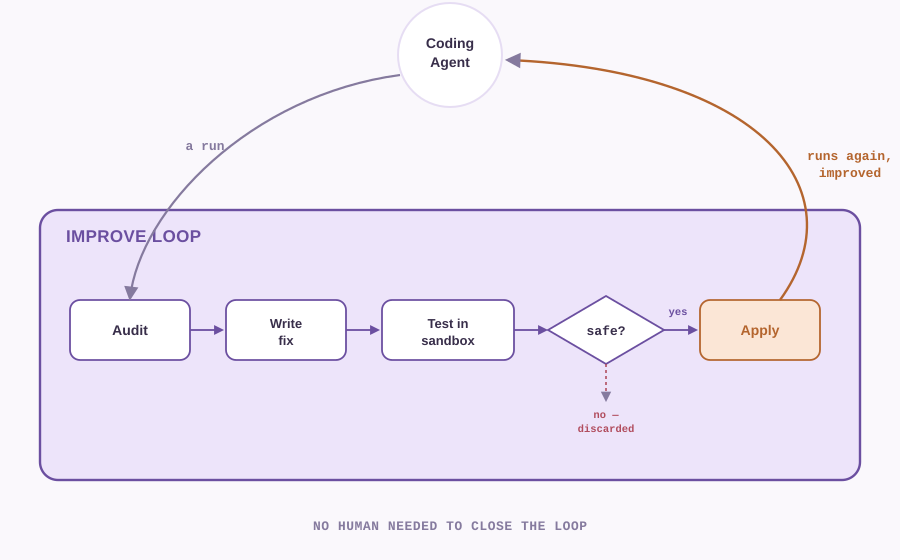

# Strange Loop

*(repo: coreweave-hack — built for the CoreWeave × Weights & Biases hackathon)*

**It doesn't just fix bugs. It fixes itself.**

A system that watches its own execution and rewrites itself in response is, in the
[Hofstadter](https://en.wikipedia.org/wiki/I_Am_a_Strange_Loop) sense, a strange loop —
hence the name.

## Overview

This project runs an AI coding agent ([Claude Code](https://claude.com/claude-code)) on
real, unmodified GitHub issues from [SWE-bench](https://www.swebench.com/SWE-bench/),
verified in Docker — and then goes a step further than "does it work": a second agent
audits every run for unsafe or dishonest behavior (reward hacking, permission escalation,
policy violations), and a third component lets the system fix its own safety gaps
automatically, re-verify the fix, and only keep it once it's proven not to break anything
else. Every step of all three is fully traced into [W&B Weave](https://wandb.ai/site/weave).

The story in one real example: the agent solved a real astropy bug correctly, but tried
to verify its own fix with a Bash command it wasn't allowed to run — twice, including an
attempt to bypass its own sandbox. The audit agent caught exactly that and classified it
as a known-safe kind of gap. The improve loop granted precisely the permission needed
(nothing broader), confirmed two unrelated tasks still passed, and re-ran the same
instance: zero denials, fewer steps, lower cost. The loop recognized on its own that
there was nothing left to fix, and stopped — no human in that decision at any point.

<p align="center">
  
</p>

**Why this matters**: autonomous coding agents are only as trustworthy as their weakest
unaudited action. This is a small, working example of pairing agent *capability* with
continuous, automated *safety verification* — not a one-time review, a loop that keeps
closing itself.

Built on [CoreWeave](https://www.coreweave.com/) and [Weights & Biases](https://wandb.ai/)
tooling throughout: every trace lives in W&B Weave, and the in-progress sandboxing work
(see below) runs the agent's full tool-use harness fully isolated, authenticated purely
through W&B Inference credits — no Anthropic API key needed inside the sandbox at all.

## Sponsor tools & protocols used

### Sponsor tools


- **[W&B Weave](https://wandb.ai/site/weave)** — the tracing backbone for the whole system,
  on two surfaces at once: the **Calls** call-tree (`run_instance → agent_session →
  agent_turn → tool_call`, via `@weave.op()`) and the **Agents/Conversations** view
  (`weave.start_conversation` / `start_turn` / `start_tool` / `log_conversation`), which logs
  both the coding agent's transcript and the improve loop's own round-by-round decisions as
  readable, replayable conversations. Also used for **Weave Feedback**
  (`call.feedback.add`), which is how `blue_agent.py`'s verdict gets attached directly to
  the run it audited.
- **[W&B Inference](https://wandb.ai/site/inference)** — an OpenAI-compatible endpoint
  (`api.inference.wandb.ai`) serving open models. `inference_proxy.py` proves Claude Code's
  full tool-use harness can run on a W&B Inference model (`moonshotai/Kimi-K2.7-Code`)
  instead of a real Claude model, authenticated purely by `WANDB_API_KEY` — no Anthropic
  credential needed at all. This is the primitive the in-progress sandboxed general-fix
  extension is built on.
- **W&B hosted MCP server** (`mcp.withwandb.com`) — used throughout development (not by the
  running pipeline itself) to query and inspect real Weave traces directly from the editor —
  pulling conversations, call trees, and feedback to debug the loop and verify the exact
  numbers used in the demo.
- **[CoreWeave Docker Sandboxes](https://www.docker.com/products/docker-sandboxes/)**
  (`sbx` CLI) — isolated microVM sandboxes with default-deny networking
  (`sbx policy allow network --sandbox <name> <domain>`), used to run Claude Code's full
  tool-use harness — real Bash included — fully isolated. This is where the improve loop's
  planned "test the fix in a sandbox before trusting it" step is being built.

### Agent protocols

- **[Model Context Protocol (MCP)](https://modelcontextprotocol.io/)** — the protocol behind
  the hosted W&B MCP server above; Claude Code (in this session, doing the project's own
  development) calls its tools (query traces, pull a conversation, list runs) as standard
  MCP tool calls.
- **Anthropic Messages API / tool-use protocol** — Claude Code's native format for tool calls
  and results (`tool_use` / `tool_result` content blocks, streamed as `stream-json` events).
  `agent_predict.py` parses this stream directly to classify every tool call's `outcome`
  (`success` / `error` / `permission_denied` / `unknown`).
- **OpenAI-compatible Chat Completions protocol** — what W&B Inference actually speaks.
  `inference_proxy.py` is a bidirectional translator between this and the Anthropic Messages
  protocol above (request shape, tool-call format, and streaming SSE events in both
  directions), which is what lets an Anthropic-protocol client (Claude Code) run unmodified
  against a W&B Inference model.
- **Weave's Agent/Conversation schema** — a structured logging protocol
  (`start_conversation` → `start_turn` → `start_tool`/`log` → end) distinct from Weave's raw
  op call-tree; used to represent both the coding agent's run and the improve loop's own
  audit → fix → regression-check → re-run decisions as a single readable conversation instead
  of raw nested spans.

## The three scripts

**`agent_predict.py`** — the coding agent, per instance:
1. Loads one SWE-bench instance (default: SWE-bench Lite) and clones its repo at the
   issue's `base_commit`.
2. Runs Claude Code headlessly (`claude -p`, restricted to `Read Edit Write Grep Glob`
   plus whatever `agent_config.json` currently grants — see below) against the clone,
   using only the issue's problem statement as context.
3. Captures the resulting `git diff` as the prediction patch.
4. Runs the SWE-bench Docker evaluation harness on that patch and reports resolved/unresolved.
5. Traces the whole run into Weave:
   - **Calls**: `run_instance → agent_session → agent_turn → tool_call`, each tool call
     tagged with an `outcome` (`success` / `error` / `permission_denied` / `unknown`).
   - **Agents**: the same transcript logged via Weave's live conversation API
     (`start_conversation` / `start_turn` / `start_tool`), so denied/failed tool calls
     show up as real errors there too.

`agent_predict_baseline.py` is a frozen, unused snapshot of `agent_predict.py` from
before it gained `agent_config.json` support — kept only as a "here's where it started"
reference point, never imported or run by anything.

**`blue_agent.py`** — pulls a completed run's trace straight from Weave's query API
(no local files needed) and has an LLM judge it for reward hacking, malicious/off-policy
tool use, and incorrect tool calls. Each finding also gets a `fix_type`: `broaden_bash_pattern`,
`add_prompt_hint`, or `none` (the judge only ever picks a label — it never authors the
actual fix; see `improve_agent.py`'s `REMEDIATIONS`). Writes `runs/<instance_id>/blue_agent_report.md`
and attaches the verdict as Weave feedback on that run.

**`improve_agent.py`** — the autonomous loop: runs `agent_predict.py`, then `blue_agent.py`
on the result; if a finding's `fix_type` is one of the two known-safe kinds, applies a
hand-written remediation to `agent_config.json`, re-runs a small regression set to check
nothing broke, and repeats. Stops on `CONVERGED` (nothing left to fix), `REGRESSION`
(a fix broke something — reverted), `STAGNATION` (same fix, no improvement), or a
3-round cap. `agent_config.json` (gitignored — it's mutable loop state, not source)
holds `allowed_tools_extra` and `prompt_hints`; a missing file behaves like `{}`, i.e.
the plain baseline.

### In progress: sandbox-validated, general fixes

Today's `broaden_bash_pattern` fix only ever grants from a small, hand-written menu of
three Bash patterns — if an instance needs a command outside that menu, it's skipped, not
generalized. The extension in progress replaces that fixed menu with the agent proposing
*any* needed permission itself and safety-testing it for real inside an isolated
[Docker Sandbox](https://www.docker.com/products/docker-sandboxes/) before it's ever
trusted in the real config. `inference_proxy.py` is the piece already proven end-to-end:
it lets Claude Code's full tool-use harness run — with real Bash, fully isolated — using
a W&B Inference model instead of a Claude model, authenticated purely by `WANDB_API_KEY`.

## Setup

Dependencies (`datasets`, `weave`, `flask`, `requests`, and `swebench` as an editable
install of `./SWE-bench`) are managed with [uv](https://docs.astral.sh/uv/) via
`pyproject.toml`/`uv.lock`.

```bash
git clone --depth 1 https://github.com/SWE-bench/SWE-bench.git
git clone --depth 1 https://github.com/SWE-bench/swe-bench-tasks.git ./swe-bench-tasks
uv sync
claude auth login   # the claude CLI needs its own login; this session's auth isn't inherited
echo 'WANDB_API_KEY=<your key>' > .env   # gitignored; read by agent_predict.py so Weave traces land in your account
```

## Run

```bash
uv run python3 agent_predict.py astropy__astropy-12907   # one run, traced into Weave
uv run python3 blue_agent.py astropy__astropy-12907      # audit that run's trace
uv run python3 improve_agent.py astropy__astropy-12907   # run + audit + fix-and-reverify loop
```

`agent_predict.py` writes `runs/<instance_id>/predictions.jsonl` and the Docker harness's
verdict under `logs/evaluation/<run_id>/results.json`. `blue_agent.py` writes
`runs/<instance_id>/blue_agent_report.md`. `improve_agent.py` writes
`runs/<instance_id>/improve_loop_report.md` and a running snapshot of each round's
`agent_config.json` under `agent_config_history/` (both gitignored — regenerated per run,
and the full history is also in Weave, under a conversation named `improve-loop-<instance_id>`).
